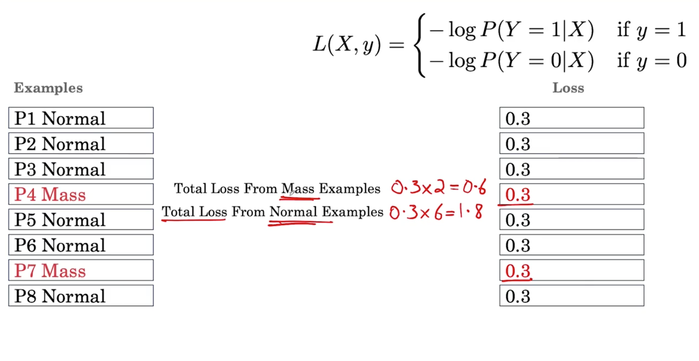
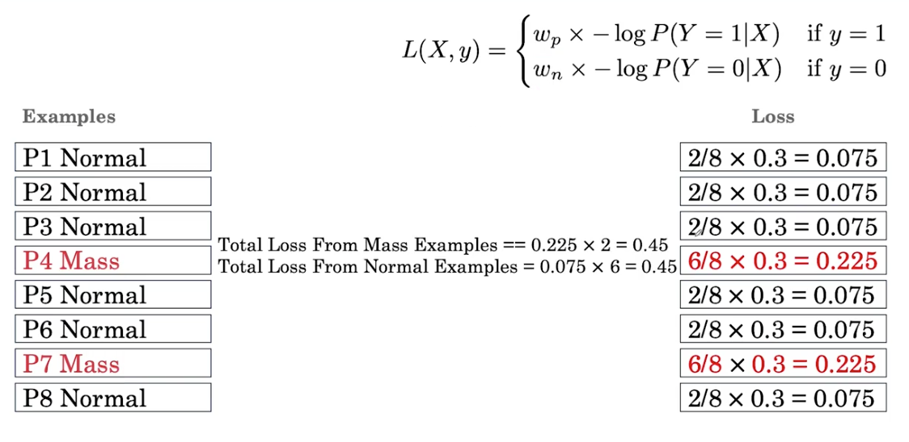
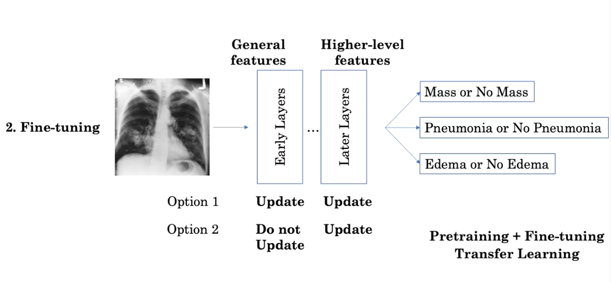

[TOC]

# Class imbalance problem

Class imbalance is very normal in medical data. 

## Weighted loss function

Using binary cross entropy, we will get the following. As we can observe, the most contribution of the total loss come from the normal class, rather than mass example, so the algorithm is optimizing to get the normal examples 

This problem can be solver by using weighed binary cross entropy, as:

$$
w_{p} =\frac{\text { num negative }}{\text { num total }} \quad w_{n}=\frac{\text { num positive }}{\text { num total }}
$$
where `w_p` is the weight for positive example asn `w_n` for the negative examples

## Resampling to achieve balanced classes

We can use less normal samples o use more than once the mass samples.

- Undersampling
- Oversampling

# Working with a small data

## Fine tuning

Medical image datasets usually be small, typically have 10 thousand to 100 thousand examples.

The best way is using transfer learning, by fine tuning a pretrained data. Because the firsts layers is for the commom patents, such as edges.

We can update all layers or only fine tune the deep layers. 

## Generating more samples: data augmentation 

There are 2 questions that drive the choice of transformations we pick:

1. We believe the transformation reflects variations that will help the model generalize the test set and therefore real world scenarios. For example we believe we believe there has contrast variation, then we can change the contrast when training
2. Verify that our transformation keeps the label the same.

Some use cases:

- rotation and fliping are useful for detect skin cancers
- change brithness or contrast may be useful for X rays
- rotation, crop and color noise are useful for histopathological images.

# Model testing

The dataset can be spited in 3:

- Training set: development of the models
- Validation set: hyperparameter tuning and model selection
- Test set: reporting of results

The training and validation set also can be combined creating a cross validation process. 

3 Challenges creating dataset in medical data:

1. Patient overlap: patient come more than once. It is possible the model can unintentionaly memorize training data. We should split by patient: all images of the same patient should remain in the same set.
2. Set sampling: in medical studies, test sets contain at least hundreds of examples. The challenge is that randonm sampling may chose all normal samples. 
   1. Test set: on way is to sample at least x% minority class. Sometimes set to 50%.
   2. As we want the validation set to have the same distribution to the test set, the same technique is applied.
3. Ground truth/reference standard: it is commen the inter-observer disagreement in medical field. How can we determine the ground truth?
   1. Consensus voting
      1. Majority voting. 
      2. We can also have the X radiologist get into a room and discuss their interpretation until they reach a single decision.
   2. Provide more information by additional medical testing:
      1. Complimente X ray with CT
      2. In detmatology, the image can be complimented by the biopsy

