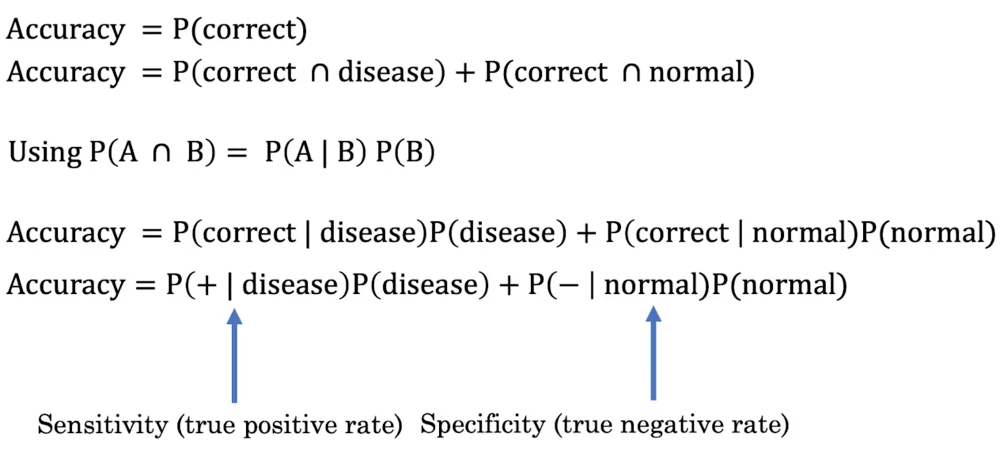
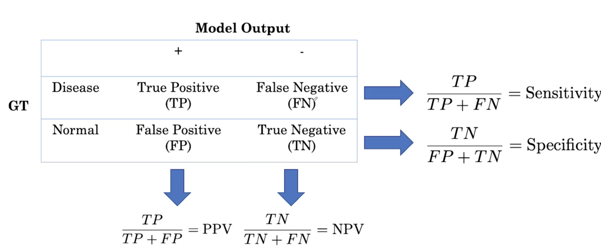

[TOC]

# Evaluating the model

## Key evaluation metrics

$$ \text{Accuracy} = \frac{\text{Exaples correctly classified}}{\text{Total number of examples}} $$

But there is a drawback using accuracy: as medical data usually be imbalanced.

$$ \text{Sensitivity} = \frac{\text{TP}}{\text{TP}+ \text{FN}}$$

$$ \text{Specificity} = \frac{\text{TN}}{\text{TN}+ \text{FP}}$$

$$ \text{Positive predictive value (Precision)} =P(pos | \hat{pos} )= \frac{\text{TP}}{\text{TP}+ \text{FP}}$$

$$ \text{Negative predictive value} = \frac{\text{TN}}{\text{TN}+ \text{FN}}$$

### Confusion matrix

## ROC curve

The ROC curve allows us to visually plot the sensitivity of a model against the specificity of the model at different decision threshold.

The threshold affects the metric. The threshold ranges in [0, 1]. With the increase of the threshold, it increase the specificity and increase the sensitivity

## Interpreting confidence intervals correctly

Let say that there are 50000 patients in the hospital and we want to find the accuracy of our chest x-ray model on everyone who gets the chest x ray in the hospital. If we have the ground truth of all those patients, we can have compute the accuracy. We find the accuracy of the model around all 50000 patients is 0.78. This is called the population accuracy `p`.

But in reality it is impossible to evaluate all the poculation. To deal with this problem, we sample a smaller amount of , let say 1000. Now we find that the model gets an accuracy of 0.8 in this set.

Confidence intervals allow us to say that using our sample, we're 95 percent confident that the population accuracy p is in the interval 0.72, 0.88. 0.72 is called the lower bound and 0.88, the upper bound of this interval.

:white_check_mark: With 95% confidence, p is in the interval [0.72, 0.88]

:x:  This not means there is a 95% probability that p lies within the interval [0.72, 0.88]

:x:  This not means 95% of the sample accuracy lie within the interval [0.72, 0.88]

The confidence interval is affected by the sample size. The larger is the sample, more confidentt we are.