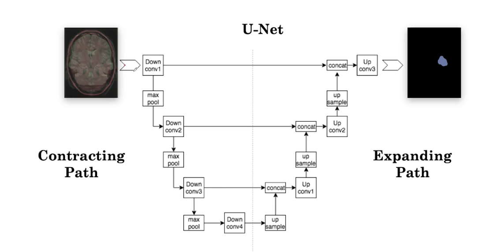
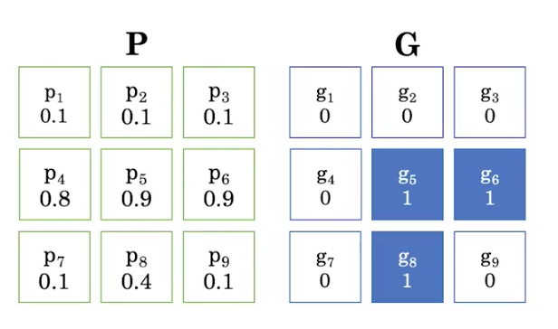
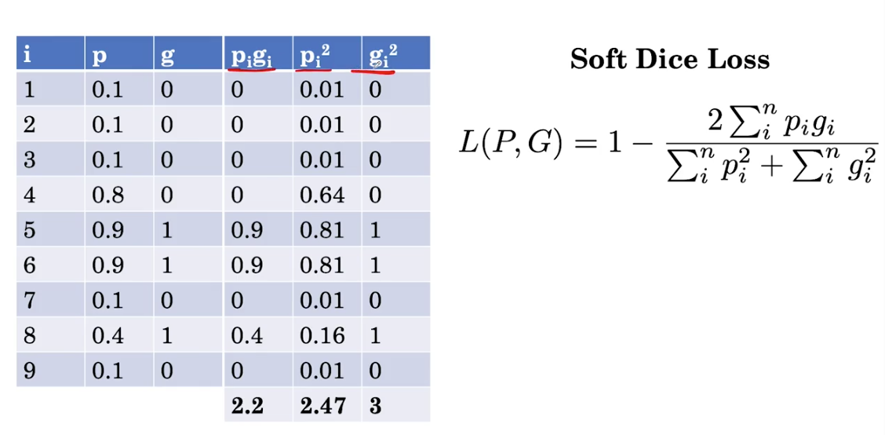

[TOC]

# MRI segmentation

An MRI image is a 3D volum, A MRI example consist of multiple image sequences, and this will consist of multiple 3D columns.

We can combine the different channels of different sequences to form a unique volume. To do that, we first have to do some preprocessing: Image registration: transform the images so they align with each other.

There are 2 ways to do the segmentation:

1. 2D approach: extract the 2D slices and one by one segment the slice. Then the 2D slice can combine to forme a 3D volume. The drawback of this approach is that we loss spatial context.
2. 3D approach: it is impossible to pass the entire 3D volume to a NN, to deal with that, we can feed the model sub-volumes. With this approach we still loss some spacial context, but we are capturing some context in all of the width, height and depth.

## Unet

[Author video](https://lmb.informatik.uni-freiburg.de/people/ronneber/u-net/)

Unet was firstly designed for biomedical image segmentation and demonstrated great results on the task of cell tracking. It can achive relatively good results even with hundreds of examples.

Unet consist of 2 path:

- Contracting path: the image get smaller
- Exoanding path: upsampling to get the original image size.

Uned is designed for 2D inputs. By replacing 2D operations by 3D operations, we can segment 3D images.

## Data augmentation for segmentation

1. When we apply transformation to input volume, we also have to apply to the label volume.

## Loss function

We use **Soft dice loss**: it works well for imbalanced data.

For example, if  `P` is the prediction and `G` is the ground truth, and $p_1 ...p_9$ represents the value of each pixel of the prediction

The soft dice can be computed as:

Where $ \frac{2 \sum_{i}^{n} p_{i} g_{i}}{\sum_{i}^{n} p_{i}^{2}+\sum_{i}^{n} g_{i}^{2}} $ measures the overlap between the predictions and the ground truth.

## Practical considerations

- Different populations and diagnostic technology. For example:
  - X ray taken from India may be different to those are taken in US
  - Old MRI has lower resolutions than those we are using now.
- So we have to measure the generalization of the mode. To do that, we need **external validation**, which contrast with internal validation. If we find our model don't genelizize to the new population, we can fine tune the model.
- Our model is trained in retrospective data, but it may not work good on real-word/prospective data. We also have to fine tune if the model don't generalize.
- We have see some ways to evaluate the model, such as AUROC curve or DICE score. However, we need metrics to reflect clinical application. We can use:
  - **Decision curve analysis**: helps to quantify the net benefit of using a model to guide patient care
  - **Randomized controlled trials**: compare patient outcomes for patients on whom the AI algorithm is applied vs whose on whom the AI algorithm is not applied
- It is also is interesting to evaluate in small groups, such as age, sex, socioconomical status. We can find algorithms bias
- How AI interact with the decision making of clinicians?