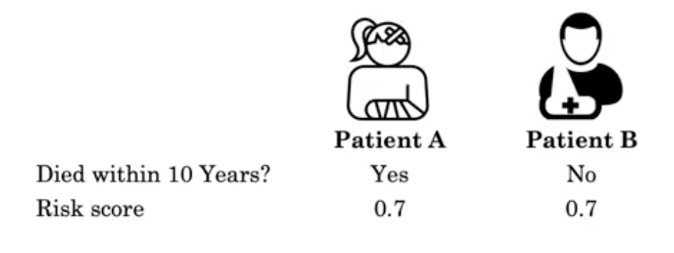

[TOC]

# Lineal prognostic models

Pre-requisits:

- Basics of machine learning
- Python
- probability knowledge

What is prognosis and why it is important?

**Prognosis** is a medical term that refers to prediction the risk of a future event, such as Death, heart attack or stroke. Is useful for:

- Informe patient the risk of illenes
- Informe patient the survival time with the illness.
- It is also useful as a guidance for treatment.

## Example Artial fibrillation

|                              | **Coefficient** | **Value 1=Yes, 0=No** | **Coefficient x value** |
| ---------------------------- | --------------- | --------------------- | ----------------------- |
| **Congestive heart failure** | 1               |                       |                         |
| **Hypertension**             | 1               |                       |                         |
| **Age 75 year or older**     | 2               |                       |                         |
| **Diabetes melitus**         | 1               |                       |                         |
| **Stroke, TIA, or TE**       | 2               |                       |                         |
| **Vascular disease**         | 1               |                       |                         |
| **Age 65 to 74 years**       | 1               |                       |                         |
| **sex category (female)**    | 1               |                       |                         |
| **Score**                    |                 |                       |                         |

**Risk equation**

A risk equation could be the sum of different coeficcients multiplying by the corresponding feature. It don't have to be lineal. It can also include interaction terms.
$$
\text {Score } =\ln Age \times \text {coefficient}_{Age}+\ln BP \times \text{coefficient}_{BP} +\ln B P \times \ln Age \times \text{coefficient}_{BP, Age}
$$
Why to use interaction terms?:

- When you find the interaction between two features, you ideally hope to see how varying one feature makes an impact on the interaction term. This is better achieved by multiplying the two features together rather than adding them together.

## Evaluating the prognostic model

| Died within 10 years | Risk score       |                  |
| -------------------- | ---------------- | ---------------- |
| A: Yes, B: No        | A: 0.9, B:0.5    | Concordant       |
| A: Yes, B: No        | A: 0.94, b: 0.94 | No concordant    |
| A: Yes, B: No        | A: 0.7, B:0.7    | Risk tie         |
| A: Yes, B: Yes       | A: 0.94, B: 0.65 | Ties in outcome. |

In general, patient with worst outcome has the higher risk score, this pair is called concordant. In other case, it is called not concordant.

When we have a pair that ties in outcome, we can't use this pair to consider who has higher risk. we only consider pairs where the outcomes are different, which is called perissible pair.

Now we can evaluate the prognostic model as:

- +1 for a permissible pair that is concordant
- +0.5 for a permissible pair for risk tie.

$$
\text{C-index} =\frac{\# \text { concordant pairs }+0.5 \times \# \text { risk ties }}{\# \text { permissible pairs }}
$$

it tells as if we gave a model to random patients A and B such that they have different outcomes, the outcome for patient A is greater than the outcome of B

$P\left(\operatorname{score}(A)>\operatorname{score}(B) | Y_{A}>Y_{B}\right)$

- a random model score: 0.5
- A perfect model score: 1