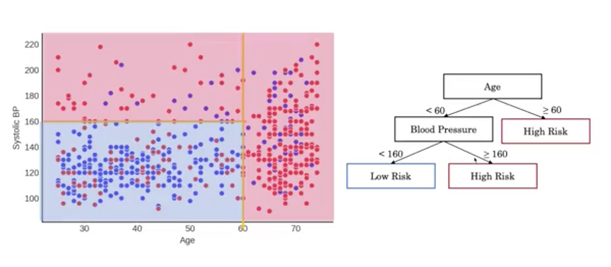
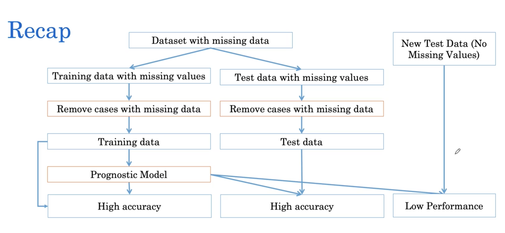
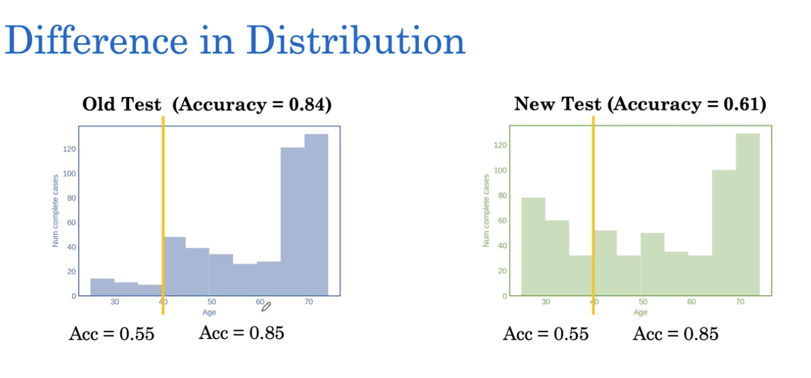
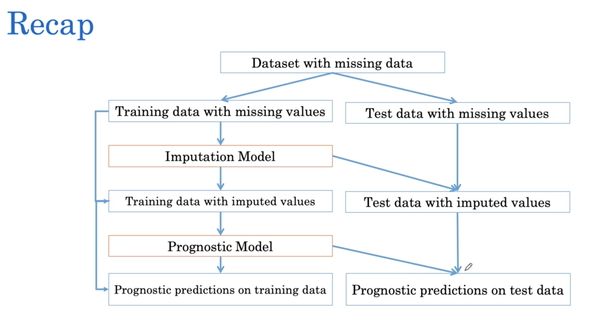

[TOC]

# Prognosis with tree based models

Decision tree divides the input feature into spaces using vertical or horizontal lines.



To avoid overfitting: 

- we set the max depth
- random forest

## Random forest

Random forests construct multiple decision trees and average the risk predictions.

Training random forest:

- Each tree is constructed using a random sample of patients. (Sample with replacement)
- RF modifies the splitting procedure in the construction of decision tree such that it uses a subset of feaches when constructing decision boundaries.

Random forests are called an ensemble learning methods because they use multiple dicision trees to obtain better prediction performance. other ensemble methods are: Gradient Boosting, XGBoost and lightGBM


## Survival data




How to deal with missing data:

- Drop incimplete rows: but this method can lead to bias. When we train with a dataset with missing data and we dropout the missing patients, when we test on a complete data, the performance may not be good. The reason of this discrepancy is that the distribution is different.

  

  - As we can observe, on the both set the accuracy for patient under 40 is poor, however, as the first set has fewer samples under 40 than the new set, then influence to the overall performance is lower.
  - Why the first set has few samples under 40? Maybe they have been dropped. Because in clinic the physicians may not regulary record blood pressure for young patients,  but it is a routine for older patients.

**Why data are missing?**

- Missing completely at random: missingness not depent on anything. In this case it don't cause bias.

  $p(\text { missing }) = 0.5$ 

- Missing at random. Missingness dependt only on available information. For example if the doctor always record the blood pressure of people older than 40, but randomly recond for patient who is under 40. In this case there are bias.

  $p(\text { missing }) \neq$ constant
  $p(\text { missing } | a g e<40)=0.5 \neq p(\text { missing } | a g e>40)=0$

- Missing not at random. Missingness dependt on unavailable information. For example the doctor record blood pressure if no other patient is waiting, but if is someone is waiting, flip a coin to determine if record the blood pressure. The difference is that patient waiting not recorded, and then the distribution is sililar.

  $\rho(\mathrm{missing}) \neq \mathrm{constant}$
  $p(\mathrm{missing} | \mathrm{waiting})=0.5 \quad p(\mathrm{missing} | \text { not waiting })=0$

But we don't know why the data is missing, so how to decide if drop?

## Imputation

Imputation replaces missing data with an estimated value based on other available information. There are different imputation methods, such as mean imputation or regression imputation.

- Mean imputation: assign all missing value the mean of all know data. We don't recompute the value of the test set, but fill missing value with the mean of the training set, because the test set usually be small but has the same distribution as the train set.
  - The main drawback is that it don't preserve the relationshop between variables. For example Blood pressure is linear with the age, but when we use mean we loss this information
- Regression imputation: use lineal model to estimate the missing data. $BP = m*age+n $




```python
from sklearn.impute import SimpleImputer
from sklearn.experimental import enable_iterative_imputer
from sklearn.impute import IterativeImputer
# mean inouter
mean_imputer = SimpleImputer(missing_values=np.NaN, strategy='mean')
mean_imputer.fit(df)
nparray_imputed_mean = mean_imputer.transform(df)

# Regression imputer
reg_imputer = IterativeImputer()
reg_imputer.fit(df)
nparray_imputed_reg = reg_imputer.transform(df)
```

