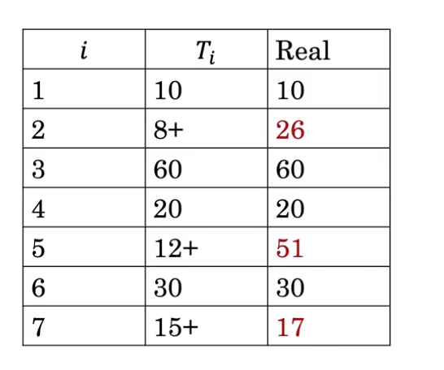
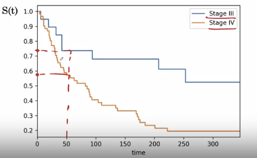

[TOC]

# Suvival models

In suvival models, we cares about the time to the occurence of an event, such as the time from treatment to recurence or time from the diagnosis to death

For example, we observe a group of a patients during a period, for the patient 1, he died after 10 months since the surgery, the second one has withdraw the study at month 8, at this point he is still live, etc. What is the probability of a patient die after `t` times?

What is the probability of suvival past any time t?

Suvival function:

$S(t)=\operatorname{Pr}(T>t)$

Properties:

- The survival probability never increase. $S(u) \leq S(v)$ if $u \geq v$
- $S(t)=\left\{\begin{array}{l}1 \text { if } t=0 \\ 0 \text { if } t=\infty\end{array}\right.$

Right censoring: the time to the event is only known to exceed a certain value

## Estimating survival function

For the given example, let say `t=25`, 

$ S(25)=Pr(T>25) = \frac{\text{Num survived 25 months}}{num patients}$

The problem is that we have right censoring datas: 8+. 12+ and 15+

Let make assumptions:

- die immediately: all right censoring died immediately. Then  $S(25)=\frac{2}{7}$
- We can also assume that they never die, then $S(25)=\frac{5}{7}$

And what happen between this 2 values?

If we can get real data, 4 of those patients survived 25 months $S(25)=\frac{4}{7}$

$\begin{aligned} S(25) &=P(T>25) \\ &=P(T \geq 26) \\ &=P(T \geq 26, T \geq 25, T \geq 24 \ldots, T \geq 0) \end{aligned}​$

## Chain rule of conditional probability

$ P(A, B) = P(A|B)P(B)​$

$P(A, B, C)=P(A|B, C) P(B|C) P(C)​$

We have that $S(25)=\operatorname{Pr}(T \geq 26, T \geq 25, T \geq 24 \ldots, T \geq 0)​$

Using chain rule:

$S(25)=\operatorname{Pr}(T \geq 26 | T \geq 25) \operatorname{Pr}(T \geq 25 | T \geq 24) \ldots \operatorname{Pr}(T \geq 1 | T \geq 0)​$

Where $\operatorname{Pr}(T \geq 26 | T \geq 25)  = \operatorname{Pr}(T>25 | T \geq 25) =1-\operatorname{Pr}(T=25 | T \geq 25)​$

The advantage of using $$ S(25)=(1-\operatorname{Pr}(T=25 | T \geq 25))(1-\operatorname{Pr}(T=24 | T \geq 24)) \ldots(1-\operatorname{Pr}(T=0 | T \geq 0)) ​$$ is that $\operatorname{Pr}(T=25 | T \geq 25)= \frac{\text{# died at 25}}{\text{# known to survival to 25}} ​$.

In the example, no one died at 25, and 2 survived to 25 $\frac{0}{2}$

The problem can be simplified to : $$=(1-\operatorname{Pr}(T=20 | T \geq 20))(1-\operatorname{Pr}(T=10 | T \geq 10)) = (1-1/3)(1-1/6) = 5/9$$

Recap:

| Assupmtion           | Probability |
| -------------------- | ----------- |
| If all dead          | 2/7=0.29    |
| If all assumed alive | 5/7=0.71    |
| Real                 | 4/7=0.57    |
| New estimation       | 5/9=0.56    |

## Kaplan meier Estimate

$$
S(t)=\prod_{i=0}^{t} 1-\operatorname{Pr}(T=i | T \geq i) = \prod_{i=0}^{t}1-\frac{\text{# died at i}}{\text{# known to survival to i} } =\prod_{i=0}^{t} 1-\frac{d_i}{n_i}
$$

With the kaplan meier estimate we can tell the difference between 2 population

