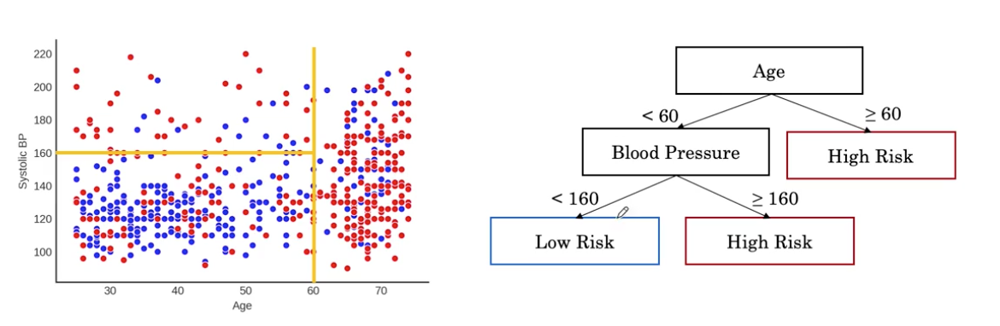
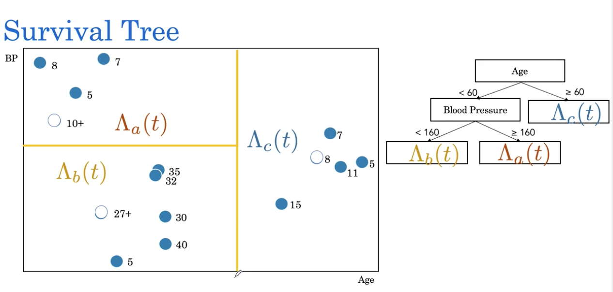
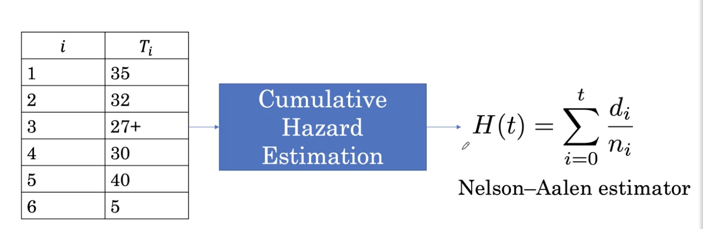
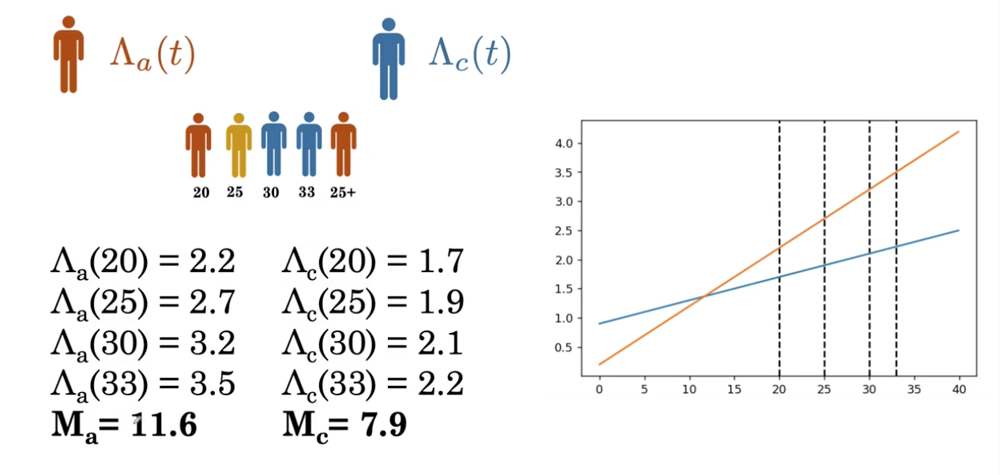
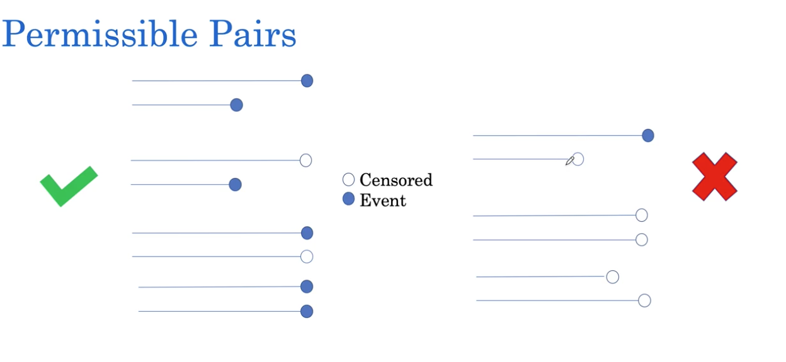
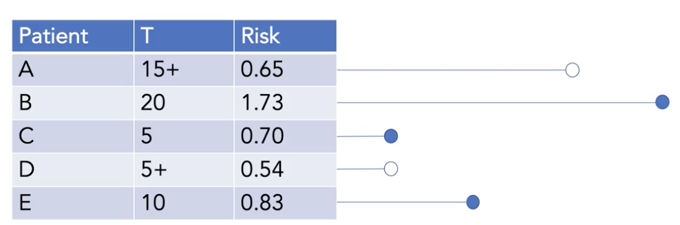

[TOC]

# Build a risk model using linear and tree-based models

## Hazard function

What's a patient's immediate risk of death if they make it to time t? The hazard function is represented as $\lambda(t)=\operatorname{Pr}(T=t | T \geq t)$

Survival to hazard: $S(t)=\exp \left(-\int_{0}^{t} \lambda(u) d u\right)$

The death probability is $1-S(t)$

We can use hazard curv to get the survival curve.

$\lambda(t)=-\frac{S^{\prime}(t)}{S(t)}$

## Cumulative hazard

What's the patients accumulated hazard up to time t?

$\Lambda(t)=\sum_{i=0}^{t} \lambda(i) \quad t=0,1,2,3$

$ \Lambda(t)=\int_{0}^{t} \lambda(u) du $

## Customizing risk models to indivisual patients

### Individualized prediction

The hazard may be very different from patient to patient, so we need to indivilualize.

$\lambda_{\text {individual }}(t)=\lambda_{0}(t) \times$ factor

where $\lambda_0$ is the baseline. The factor is determine by the individual, for example $$\lambda(t)=\lambda_{0}(t) \exp (0.08 \times \text { is_smoker }+0.01 \times \text { age })$$

We use $exp$ to ensure the output is always greater than 0.

For example:

| Age  | Smoker | Risk                                          |
| ---- | ------ | --------------------------------------------- |
| 50   | Yes    | $\lambda_0+e^{0.08*1+0.01*50}=\lambda_0*1.79$ |
| 30   | No     | $\lambda_0+e^{0.08*0+0.01*30}=\lambda_0*1.35$ |
| 50   | No     | $\lambda_0+e^{0.08*0+0.01*50}=\lambda_0*1.65$ |

Then we can rank patients by risk

$\lambda_0$ is greater than 0, so the risk of patient 1 is always greatet than patient 2.

### Individual vs baseline hazard

if all of the variables are 0, then $\lambda(t)=\lambda_0(t)*1$

The baseline hazard can be any shape.

We can also find the relationship between smoker and no smoker:
$$
\frac{\lambda_{smoker}}{\lambda_{nonsmoker}} \frac{\lambda_0(t) \exp^{ (0.08+0.01 \times \text{age}})}{\lambda_0(t) \exp^{(0.01 \times age)}} = \exp^{0.08}=1.08
$$
We do the samething to find the ratio for the age. How much more risky is being 51 compared to 50?
$$
\frac{\lambda_{51}(t)}{\lambda_{50}(t)}=\frac{\lambda_{0}(t)\exp ^\left(0.08 \times \text{is_smoker}\right) \exp ^{(0.01 \times 51)}}{\lambda_{0}(t) \exp ^{\left(0.08 \times \text{is_smoker}\right)} \exp ^{(0.01 \times 50)}} = \exp^{0.01*51-0.01*50} = 1.01
$$

| Variable  | Weight | exp(Weight) |
| --------- | ------ | ----------- |
| is_smoker | 0.08   | 1.08        |
| age       | 0.01   | 1.01        |

We can observe that the risk factor increase for a unit increase in the variable.

Then we can generalize the function:
$$
\lambda(t) =\lambda_0(t) \exp^{ \sum_i B_iX_i}
$$
where $\exp(B_i)$ represents the factor risk increases when x_i becomes x_i+1

## Non linear risk models with suvival trees

We assumes the baseline for each patient is equal, but in the real world may not be equal.

Our goal is to find hazard function for different group of peoples in the population

The difference between survival tree and decision tree is:

- We are now dealing with the time to event model, we don't just say whether something is low risk or high risk, we are saying waht the risk is at every time point t
- We are now dealing with survival data, we have survival time.

### Nelson Aalen estimator

How to estimate the hazard function for a specific group?

For t==33:

$ H(33) = \sum_{i=0}^{33} \frac{d_i}{n_i} = \frac{d_{5}}{n_{5}}+\frac{d_{30}}{n_{30}}+\frac{d_{32}}{n_{32}} = \frac{1}{6}+\frac{1}{4}+\frac{1}{3}=0,75 $

Notice that the n_i is to to t, including t

### Comparing risks of patients

When 2 patients belongs to 2 groups, the risk may cross at same point. Such as the risk of patient1 at t=12 is lower than patient 2, but it is higher when t>12. So to to able to tell which one of them is more at risk we have to know what time we care about comparing the cumulative hazard of the 2.

To compare, we have a population, then we can find the risk  value at each time point of the population. The mortality score is the sum of the hazard risk score.

## Evaluation of survival model

Survival models has 2 difference comparing with the prognostic model:

1. We have time data
2. We have censored data

| T_a  | Risk_a | T_b  | Risk_b |                                    | Permissible     |
| ---- | ------ | ---- | ------ | ---------------------------------- | --------------- |
| 20   | 0.94   | 40   | 0.65   | Concordant, t_a<t_b, risk_a>risk_b |                 |
| 40   | 0.6    | 40   | 0.6    | Concordant                         |                 |
| 20   | 0.4    | 40   | 0.65   | Not concordant                     |                 |
| 20   | 0.65   | 40   | 0.65   | Risk tie                           |                 |
| 40   | 0.4    | 40   | 0.65   | Risk tie                           |                 |
| 20   | 0.94   | 40+  | 0.65   |                                    | permissible     |
| 20+  | 0.94   | 40   | 0.65   |                                    | non permissible |
| 40+  | 0.94   | 40+  | 0.65   |                                    | Non permissible |

Concordance: patient with worse outcome should have higher risk score.

Worse outcome means that if a patient has an event earlier.

When time to event is the same, in this case, we'd want an ideal risk score to say that the risks for both of them is the same, so it is also concordant.

Risk ties: same event time or same risk

**Permissible pair**

- When at least one patient is not censored
  - A pair may be permissible if at least one patient is not censored.
  - If both pairs of patients are censored, then they are definitely not a permissible pair.
- If neither patient is censored
  - If both patients had an event (neither one was censored). This is definitely a permissible pair.
- When one patient is censored:
  - If we know that one patient was censored and one had an event, then we can check if censored patient's time is at least as great as the uncensored patient's time. If so, it's a permissible pair as well

Harrell's C-Index

C-index $=\frac{\# \text { concordant pairs }+0.5 \times \# \text { risk ties }}{\# \text { permissible pairs }}$

We have different definition of concordant pairs, risk ties and permissible pairs.

Permissible: {A,C}, {A,E}, {B,C}, {B,E}, {C,D}, {C,E}

Concordant: {A,C}, {A,E}, {C,D}

Risk ties: None

$\text{C-index} = \frac{3+0.5*0}{5}=0.5$