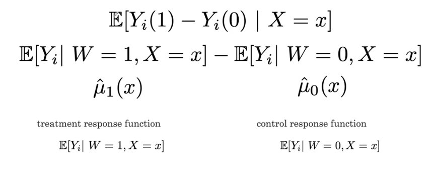
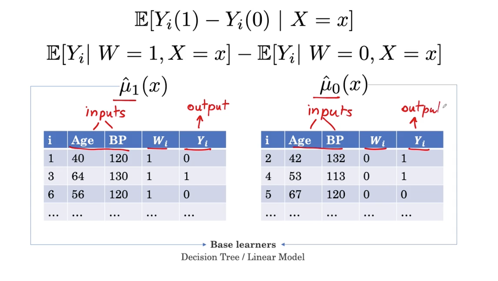
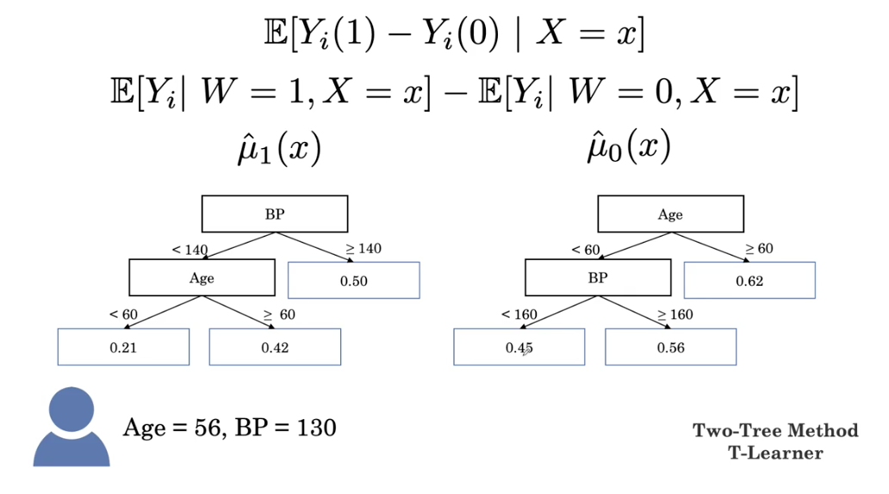
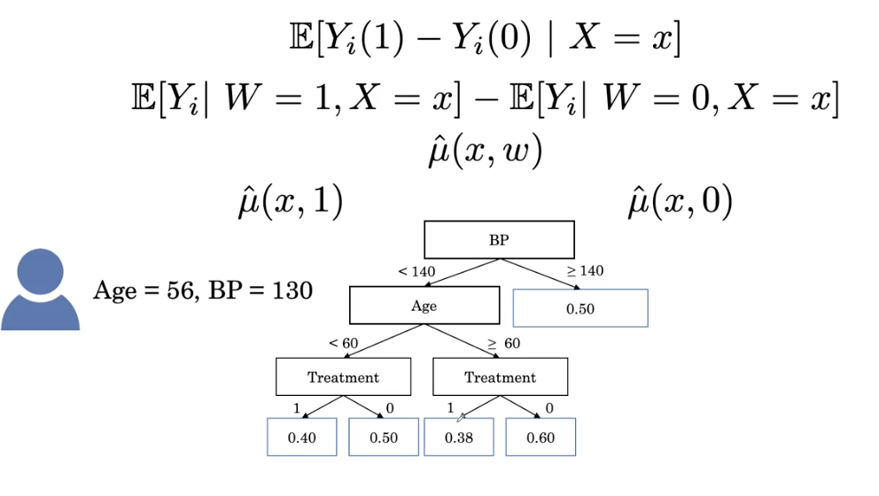
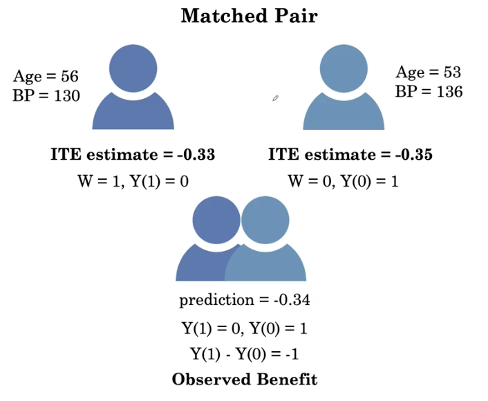
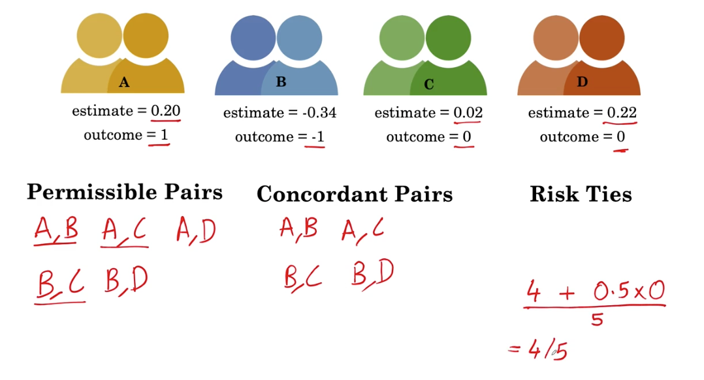
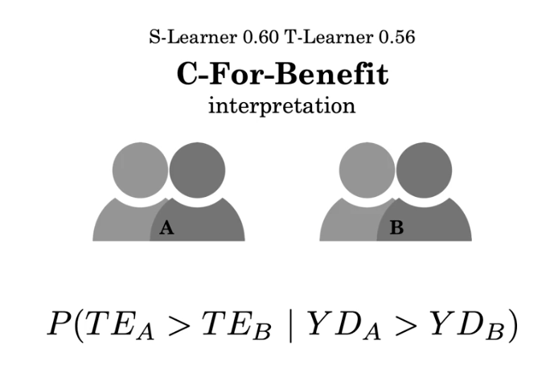

[toc]

# Randomized control trials

If we have a new drug, we have to test it. We divide our pacients in 2 groups, one with new drug and another one with old drug/placebo. Then, the absolute ristk of the first is 0.02(new) and for the second is 0.05(old). So with new drug we have 0.03 **absolute risk reduction(ARR)**.

The doctor is worried of how the patient is selected, for example, the first grup is most yough and heathy and the another one is old. But you say that the group is randomly assigned, which is called **randomized controlled trial**, they have similar age and blood pressure.

How do we know the improvement is significant -> p value.

**Number needed to treat**: number of people needed to recieve people in order to benefit one of them, in our case, NNT =1/0.03=33.3, if we treat 33 people we will save one person.

# Average treatment effect

## Casual infernece

| Unit | Outcome without treatment | Outcome with treatment    | Effect    |
| ---- | ------------------------- | ------------------------- | --------- |
| 1    | Doesn't have heart attack | Has heart attack          | Benefit   |
| 2    | Has heart attack          | Has heart attack          | No effect |
| 3    | Doesn't have heart attack | Doesn't have heart attack | No effect |
| 4    | Has heart attack          | Doesn't have heart attack | harm      |

**Neyman-Rubin casual model**

|  i   | Yi(1) with treatment | Yi(0) without treatment | Yi(1)-Yi(0)  |
| :--: | :------------------: | :---------------------: | :----------: |
|  1   |          0           |            1            | -1 (benefit) |
|  2   |          1           |            1            |      0       |
|  3   |          1           |            0            |      1       |
|  4   |          0           |            0            |      0       |
|  5   |          0           |            1            |      -1      |
| Mean |         0.4          |           0.6           |     -0.2     |

0: doesn't have heart attack

1: has heart attack = 1

**Averate treatment effect (ATE)**: expectation of the difference in the potential outcome.

- If negative is benefit
- If positive: harm

$\mathbb{E}\left[Y_{i}(1)-Y_{i}(0)\right]$

However, if we give people treatment, we don't know what will happen if we don't give them treatment and viceversa. If W_i represents if the patient is treated or not, how do we estimate the averate treatment effect?

|  i   |Wi |Yi(1) with treatment | Yi(0) without treatment | Yi(1)-Yi(0)  |
| :--: | :--: |:------------------: | :---------------------: | :----------: |
|  1   | 1 |         0           |            ?            | ? |
|  2   | 0 |         ?           |            1            |      ?      |
|  3   | 1 |         1           |            ?            |      ?      |
|  4   | 1 |         0           |            ?            |      ?      |
|  5   | 0 |         ?          |            1            |      ?      |
| ... | |                  |                         |      ?      |

We can compute the average treatment effect if the group is randomized controlled trials. We can group the patient into treated and not treated and compute the mean effect.

$\mathbb{E}\left[Y_{i}(1)-Y_{i}(0)\right]=\mathbb{E}\left[Y_{i} \mid W=1\right]-\mathbb{E}\left[Y_{i} \mid W=0\right]$

## Conditional average treatment effect

$\mathbb{E}\left[Y_{i}(1)-Y_{i}(0) \mid A g e=56\right]$ in a randomized controlled trials.

$\mathbb{E}\left[Y_{i}(1)-Y_{i}(0) \mid A g e=56\right] = \mathbb{E}\left[Y_{i} \mid W=1, A g e=56\right]-\mathbb{E}\left[Y_{i} \mid W=0, A g e=56\right]$

What about if other condition can't be found? For example $\mathbb{E}\left[Y_{i}(1)-Y_{i}(0) \mid A q e=56, B P=130\right]$. However, we don't have any sample with age 56 and blood pressure 150. We can learn the relationship between Age, BP and Y

## T-learer: two tree method

Then we can use tree model:

Then the CATE for this patient is 0.21-0.45=-0.24

## S-learner: single tree method

The CATE for this patient is 0.4-0.5=-0.1

The disadvantage with the S-learner is that we might learn a tree that may decide not to use the treatment feature at all. 

T-learer use half of data and there is less data available to learn the relationship between the features.

# Individualized treatment effect

## Evaluate individualized treatment effect

We can find patient with similar features:

## C for benefits

C -for-benefit is similar to index. There are 3 outcomes:

- -1: benefit
- 0: no effect
- 1: harm

**Concordant pait**: We call a pair of matched pairs concordant  when the pair with the higher number for the estimate has the higher outcome.

| Estimate1 | Outcome1 | Estimate2 | Outcome2 |                 |                     |
| --------- | -------- | --------- | -------- | --------------- | ------------------- |
| 0.2       | 1        | -0.24     | -1       | 0.2>-0.34, 1>-1 | Concordant pair     |
| 0.2       | 1        | 0.23      | -1       | 0.2<0.23, 1>-1  | Not concordant pair |
| 0.2       | 1        | 0.2       | -1       | 0.2=0.2         | Risk tie            |
| 0.2       | 1        | 0.1       | 1        | 1=1             | Tie in outcome      |

- Concordant pair:   when the pair with the higher number for the estimate has the higher outcome
- Not concordant pair:  when the pair with the higher estimate number has the lower outcome level.
- Risk tie: when we make the same effect estimate for  both pairs when they have different outcomes.
- Tie in outcome: we aren't able to tell which pair should have the higher score. 

$ \text{C-index} =\frac{\# \text { concordant pairs }+0.5 \times \# \text { risk ties }}{\# \text { permissible pairs }}$

**C-for-benefit computation**

1. Divide into treated or not treated
2. Compute the individual treatment effect using T-Learner or S-Learner
3. Sort by IDE
4. Match pairs and compute Outcome and estimate
5. Then, compute C-for-benefit

The C-for-benefit means that given two randomly chosen pairs, A and B with different outcomes, what is the probability that the pair with the greater treatment effect estimate also has the greater Y diff?

