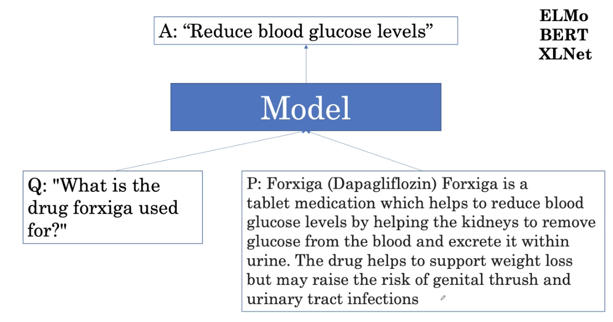
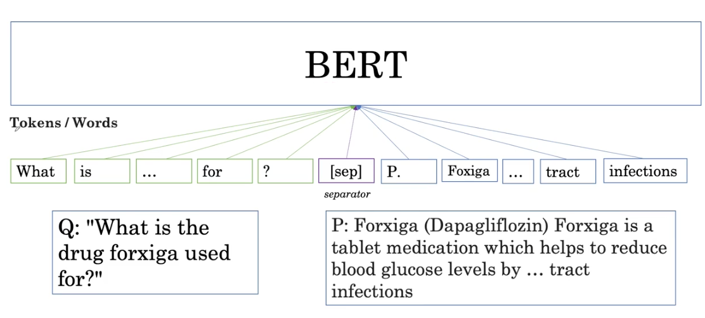
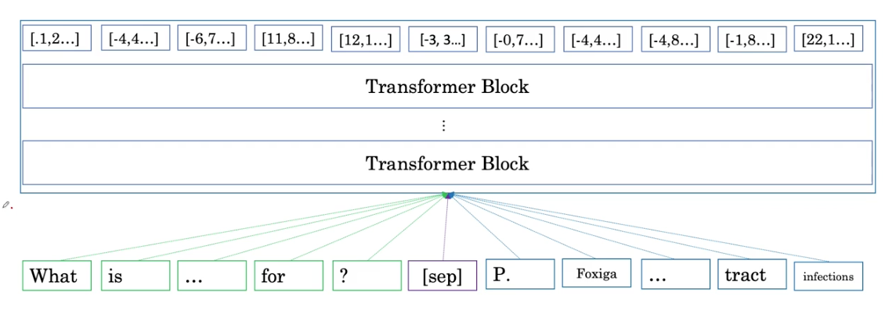
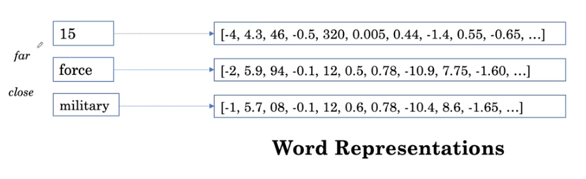
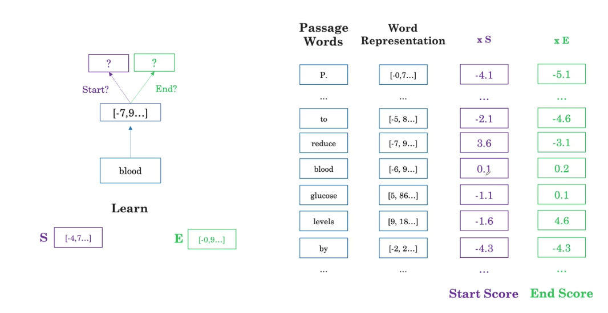
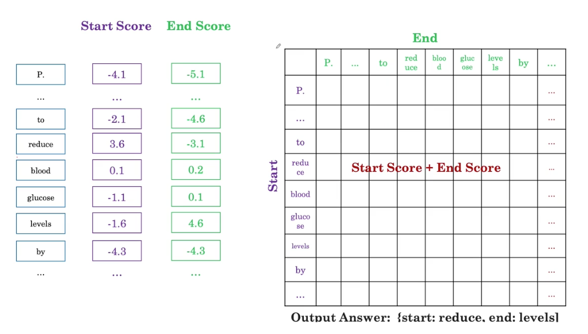
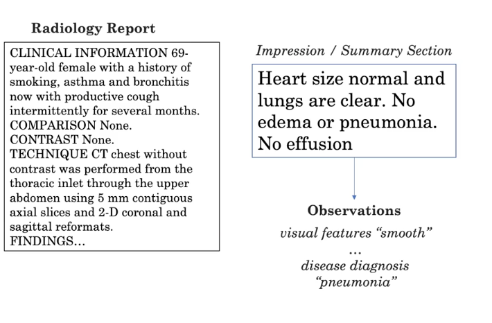
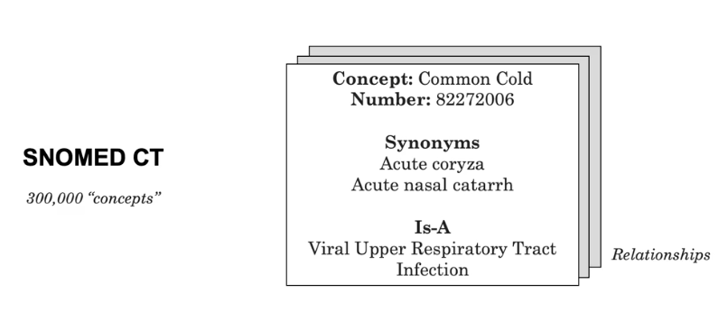

[toc]

# Medical questing answring

In this lesson, we will use BERT to answer medical questions.

The model takes as input:

- Question
- Passage: which could come from a search engine

and extracts a short phrase from the passage that answer the question

- Separator to separate question from ppassage.

Using several transformer blocks and it transform it to a vector-> word representation

unrelated words are far, such as `15`and `force`, their distance of the vector is large, whereas `force`and `military`are close

We can attempt to visualize these word dimensions by reducing the dimensions of the vectors to two dimensions using methods such as t-SNE so we can see them graphically. 

The **main challenge** of word representation is how to deal with words with multiple meanings. We can use the context to determine the meaning

- Non contextualized word representations: word2vec, GloVe
- Contextualized: ELMo, BERT

## Define the answer in a text

The model determine whether each word in the passage is one of the start or the end of an answer to a question

The model learns two vectors, S and E for each of the word representations, for each of the words in the passage. The word representation is multiplied by S to get a single number, which is the start score for that word. The higher the start score, the more likely it is to be the start of the answer. Similary we compute the end score.

# Automatic labeling

## Automatic label extraction for medical imaging

When we have a X-ray, it is very expensive having radiologists annotating images, we can use rediology reports to extract labels. 

If there are radiology report and labels, it is a supervised learning algorithm(using BERT for example), the challenge is when we don't have the label,

W step to extract labels:

1. Whether if an observation mentions
2. Classify whether observation is present or absent

We have to list out not only the word we are loking for, but also synonyms. In case of pneumonia, it could be infection, infectious process, etc. 

And how to find synonyms? We can use terminologies. An example is SNOMED CT, which contains 300000 concepts, for example common could.

"There is a possible infection in the lungs"? 

- Is lung disease mentioned?
  - No, infection is not directly related with lung disease, however, pneumonia is a lung disease
  - Terminology contain IS-A relatio.
    - Viral pneomoonia IS-A infectious pneumonia
    - Infectious pneumonia IS-A Pneumonia
    - Pneumonia IS-A Lung disease

The advantage is that it is unsupervised learning. The disadvantage is that we have to manually set rules

# Evaluation

options:

- Macro average: compute metric for each class and then average. Give equal importance to each class
- Micro average: compute the metric globally. Give equal importance to each sample.