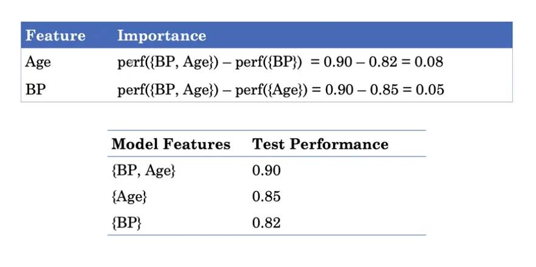
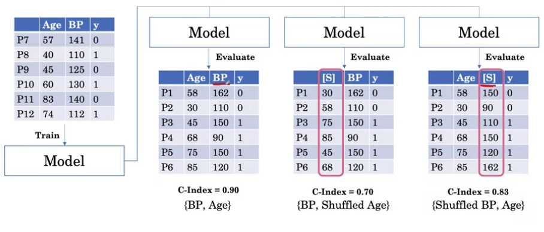
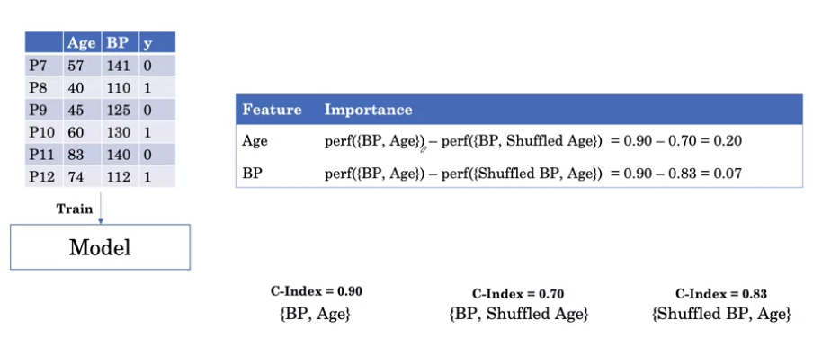
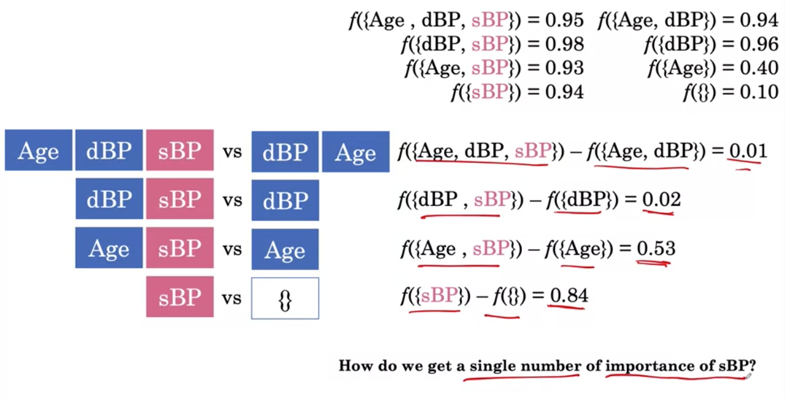
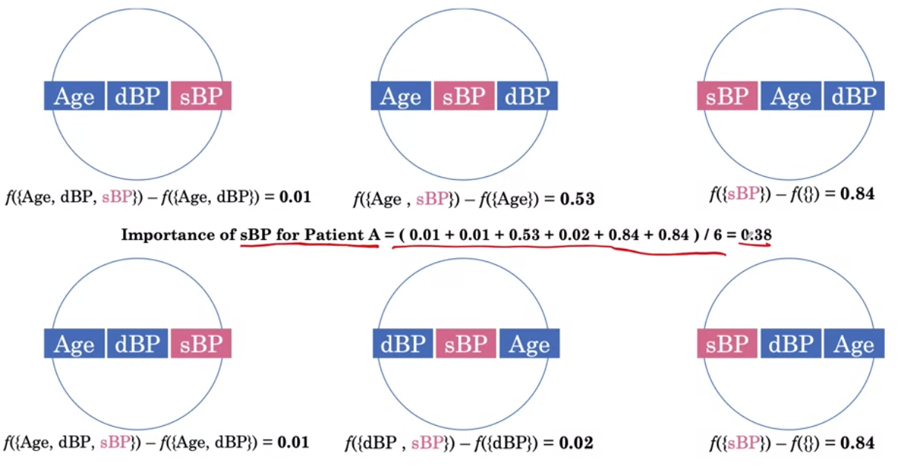
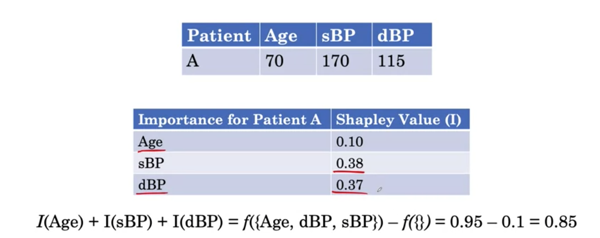
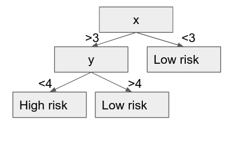

[toc]

# Feature importance

- Drop columns: if we have a model with  2 features: blood pressure and age. We can train 3 models: one with  blood pressure and age, other with BP and a third with age. Then we can compute the test performance for each of those models we can know the importance of age and BP by subtracting model(BP, age) - model(BP)

  - The challenge of this is that we have to build additional models, which is computationaly expensive.

  

- Permutation method: we can randomly shufle a feature and see the drop in the performance. 

  - As the drop shuffling age is greater than BP (0.2 vs 0.7), we can say that age is more important

  

  

  

# Individual feature importante

We want to understand a feature's importance on the individual prediction.

- Drop columns: only look for the prediction, not the model performance.

  - Problematic when there are correlated features

- shapley value: we can train different models and compute the output

  - Shapley value for sBP = F({Age, dBP, sBP})-f({Age, dBP}) = 0.95-0.94=0.01
  - The special case here is the empty set for which we are going to define the model output as the expected value of the outcome in the dataset. So in this case, 10% of the patient population actually have the event

  

  

  

- Tell us telling us how much each feature contributes to the additional risk over the baseline risk of the population.

# Interpreting deep learning models

# Quizes

1. You train the random forest pictured below and it gets a c-index of 0.90. After shuffling the values for x, your dataset is the following. What is the variable importance for x?

| ID   | x    | y    | death |
| :--- | :--- | :--- | :---- |
| 1    | 2    | 3    | 1     |
| 2    | 4    | 5    | 0     |
| 3    | 1    | 2    | 1     |
| 4    | 5    | 2    | 0     |

options: 

- -0.05

- 0.1 incorrect

- 0.5 incorrect
- 0.65

2. Say you have trained a decision tree which never splits on a variable X. What will be the variable importance for X using the permutation method?

- 0.5
- A random number between 0 and 1: incorrect
- 0
- There is too little information to say: incorrect

3. We have the following table the output of a model f on an example using subsets of the variable. What is the Shapley value for s_BP?

| Feature Set  | Output |
| :----------- | :----- |
| {}           | 0.5    |
| {s_BP}       | 0.7    |
| {d_BP}       | 0.6    |
| {s_BP, d_BP} | 0.65   |

- 0.0

- 0.2

- 0.05
- 0.125: correct

Refer to the lesson **Combining importances**.

We know that we compute our Shapley value by taking the prediction value of all features and subtracting it by the prediction values of the features that don't contain our desired value. We do this until we take the prediction value of the desired feature minus the prediction value of the empty set.

We compute the Shapley value for s_BP in the following way:

{d_BP, **s_BP**} - {d_BP} = (0.65) - (0.6) = **0.05**

{**s_BP**} - {} = (0.7) - (0.5) = **0.2**

Once we have obtained all of our values, we sum them up altogether, then divide by the number of features we have. In this case, we have 2 total features, so we divide by 2.

Calculate the importance of **s_BP**:

( (0.05) + (0.2) ) / 2

(0.25) / 2

The shapley value for s_BP is: **0.125**

4. We have the following table the output of a model f on an example using subsets of the variable. What is the sum of the Shapley value for s_BP and d_BP? 

| Feature Set  | Output |
| :----------- | :----- |
| {}           | 0.5    |
| {s_BP}       | 0.7    |
| {d_BP}       | 0.6    |
| {s_BP, d_BP} | 0.65   |

- 0.0
- 0.2
- 0.05
- 0.15

We already know the Shapley value of **s_BP** from Question 3 (0.125). Thus, all we need to calculate is the Shapley value from **d_BP**.

We compute the shapley value for d_BP in the following way:

{s_BP, **d_BP**} - {s_BP} = (0.65) - (0.7) = **-0.05**

{**d_BP**} - {} = (0.6) - (0.5) = **0.1**

Once we have obtained all of our values, we sum them up altogether, then divide by the number of features we have. In this case, we have 2 total features, so we divide by 2.

Calculate the importance of **d_BP**:

(0.1 + (-0.05) ) / 2

(0.05) / 2

The Shapley value for d_BP is: **0.025**

Since we want to calculate the sum of the Shapley value for s_BP and d_BP, and we already know the value of s_BP from the previous exercise we can sum:

{**s_BP**} + {**d_BP**} =

(0.125) + (0.025) =

**0.15**

5. Could the following table of outputs be given by a linear model with no interactions (assume not including a feature means setting it to 0)?

 

| Feature Set  | Output |
| :----------- | :----- |
| {}           | 0.5    |
| {s_BP}       | 0.7    |
| {d_BP}       | 0.6    |
| {s_BP, d_BP} | 0.65   |

- Yes

- No

Explanation: The answer is no. We see that when only adding d_BP, the output goes up, so the coefficient for it must be positive. We also see that when only adding s_BP the output increases, so the coefficient must be positive. However, when we add d_BP to the output with s_BP, the output goes down, a contradiction, since we already know the coefficient for d_BP is positive. This suggests that there must be at least an interaction between s_BP and d_BP.

6. Now assume we add Age as a variable. What is the new Shapley value for s_BP?

| Feature Set       | Output |
| :---------------- | :----- |
| {}                | 0.5    |
| {s_BP}            | 0.7    |
| {d_BP}            | 0.6    |
| {Age}             | 0.7    |
| {s_BP, d_BP}      | 0.65   |
| {s_BP, Age}       | 0.7    |
| {d_BP, Age}       | 0.8    |
| {d_BP, s_BP, Age} | 0.85   |

- 0
- 0.09
- 0.125 incorrect
- 0.20 incorrect

Explanation: This computation will be a bit more involved. We see that if s_BP comes first, we get +0.2. If s_BP comes after d_BP, then we get +0.05, as before. If s_BP comes after Age, it gets + 0.0. Finally, if it comes after both d_BP and Age, it gets +0.05. Now we have to take a weighted average. THe probability s_BP comes first is ⅓, the probability it comes last is ⅓, and the probability it comes after d_BP is ⅙ and after Age is ⅙ . Now, the weighted average is ⅓ (0.2) + ⅙(0.05) + ⅙(0.0) + ⅓(0.05) ~ 0.09, so the answer is B.